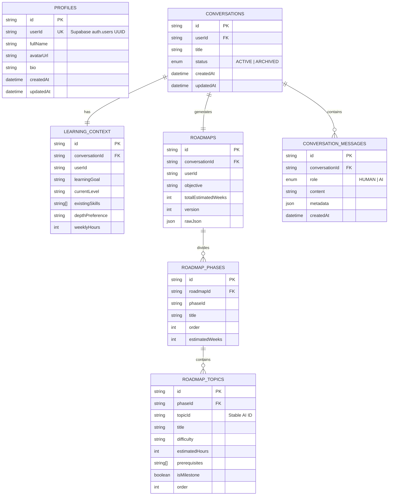

# 🧠 AI-Powered Personalized Learning Path Recommender

> An intelligent, context-aware adaptive learning platform that analyzes learner skills, goals, constraints, and learning history to identify skill gaps, generate structured interactive roadmaps, and provide real-time Socratic AI tutoring.

---

## 📌 Table of Contents
- [Executive Overview](#-executive-overview)
- [Problem Statement](#-problem-statement)
- [Proposed Solution](#-proposed-solution)
- [Key Features](#-key-features)
- [System Architecture & Data Flow](#-system-architecture--data-flow)
- [Complete Tech Stack](#-complete-tech-stack)
- [Project Directory Structure](#-project-directory-structure)
- [Database Schema & Data Models](#-database-schema--data-models)
- [API Reference](#-api-reference)
- [Setup & Installation Guide](#-setup--installation-guide)
- [Resilience & Production Readiness](#-resilience--production-readiness)

---

## 🌟 Executive Overview

In the modern digital era, learners are overwhelmed by vast amounts of fragmented information across tutorials, courses, documentation, and videos. Traditional learning platforms offer static, one-size-fits-all curricula that fail to account for a student's existing knowledge, target goals, available time, or depth preference.

The **AI-Powered Personalized Learning Path Recommender** solves this challenge by leveraging modern Generative AI (**Mistral AI** orchestrated via **LangChain**), high-performance caching (**Redis**), asynchronous background persistence (**BullMQ**), and modern relational data modeling (**Prisma v7 + Supabase PostgreSQL**), presented through an ultra-responsive, motion-enhanced **React 19 & Tailwind CSS** frontend.

---

## ❗ Problem Statement

1. **Information Overload & Fragmented Resources:** Learners spend hours discovering *what* to learn next rather than actually learning.
2. **One-Size-Fits-All Curricula:** Existing platforms force beginners and experienced engineers through identical rigid syllabi.
3. **Unidentified Skill Gaps:** Learners lack clarity on prerequisite knowledge required before taking on advanced topics.
4. **Lack of Dynamic Feedback:** When a student gets stuck on a topic or needs to adjust their learning pace, static courses cannot adapt.
5. **Slow, Monolithic Architectures:** Traditional learning management systems suffer high latency and lack real-time streaming conversational assistance.

---

## 💡 Proposed Solution

Our application introduces an **Adaptive AI Learning Engine**:

- 📝 **Intelligent Questionnaire & Diagnostics:** Captures learning goals, existing skills, weekly commitment hours, depth preference (surface, balanced, or deep dive), and motivations.
- 🗺️ **Dynamic Roadmap Generation:** Generates a structured multi-phase learning path with AI-assigned stable topic IDs, prerequisite dependency graphs, estimated hours, projects, and milestones.
- 💬 **Streaming Socratic AI Tutor:** An integrated conversational assistant powered by Mistral AI with Server-Sent Events (SSE) streaming that answers topic-specific doubts, offers real-time quizzes, and dynamically adapts the roadmap.
- ⚡ **Asynchronous Dual-Tier Architecture:** Utilizes Redis for sub-millisecond conversation & roadmap caching, and BullMQ background workers to asynchronously persist chat histories and roadmap state to PostgreSQL without blocking the user response.
- 🛡️ **Decoupled Auth & Dual DB Strategy:** Supabase Auth for JWT security + Prisma v7 with PgBouncer connection pooling for runtime scale and direct connection for instant migrations.

---

## ✨ Key Features

| Feature | Description |
| :--- | :--- |
| 🎯 **Personalized Questionnaire** | Multi-step interactive assessment analyzing skills, goals, available hours, and learning depth. |
| 🗺️ **Visual Step-by-Step Roadmap** | Interactive phase-by-phase curriculum graph with progress markers, topic prerequisites, and milestone projects. |
| 🤖 **Real-Time AI Assistant** | Streaming LLM tutor using Mistral AI that maintains conversational memory and context. |
| 📊 **Skills Gap & Analytics Radar** | Visual breakdown of existing vs. target skills with progress tracking and competency metrics. |
| 📚 **Curated Course Deep Dives** | Topic-linked interactive course modules with structured lessons, code snippets, and hands-on exercises. |
| 🔐 **Complete Authentication Suite** | Secure Signup, Login, Google OAuth, Session Management, and Password Reset powered by Supabase Auth. |
| 🌙 **Theme & Fluid Motion UI** | Built with Framer Motion, Lenis smooth scroll, Lucide icons, Sonner notifications, and responsive dark/light modes. |

---

## 🏗️ System Architecture & Data Flow

```
┌─────────────────────────────────────────────────────────────────────────────┐
│                             REACT 19 FRONTEND                               │
│  (Vite + TypeScript + Tailwind CSS + Framer Motion + React Router v7)       │
└──────────────────────────────────────┬──────────────────────────────────────┘
                                       │ HTTP / REST / SSE Stream
                                       ▼
┌─────────────────────────────────────────────────────────────────────────────┐
│                            EXPRESS 5 BACKEND API                            │
│  ├── /api/auth     : Supabase Auth SDK (JWT, Google OAuth, Passwords)       │
│  ├── /api/profile  : Prisma ORM User Profile CRUD                           │
│  └── /api/ai       : LangChain + Mistral AI Streaming Orchestration         │
└──────────────┬───────────────────────┬──────────────────────┬───────────────┘
               │                       │                      │
      (Read/Write Cache)      (Enqueues Job)         (Direct & Pooler)
               ▼                       ▼                      ▼
┌─────────────────────────┐ ┌─────────────────────┐ ┌─────────────────────────┐
│       REDIS CACHE       │ │    BULLMQ WORKER    │ │   SUPABASE POSTGRESQL   │
│ - Conversation History  │ │ (Async Persistence) │ │ - auth.users            │
│ - Active Roadmaps       │ │ - Messages to DB    │ │ - public.profiles       │
│ - Instant In-Memory Read│ │ - Roadmaps to DB    │ │ - public.roadmaps       │
└─────────────────────────┘ └──────────┬──────────┘ │ - public.conversations  │
                                       │            └────────────▲────────────┘
                                       └─────────────────────────┘
```

### 🔄 End-to-End Workflow

1. **User Profiling & Questionnaire:** User submits learning background and goals.
2. **AI Roadmap Generation:** Backend invokes LangChain + Mistral AI structured prompt to produce a phased curriculum with topic dependencies.
3. **Instant Cache + Background Persistence:** The roadmap is cached in Redis for instantaneous client access and queued via BullMQ for background PostgreSQL writes.
4. **Streaming Socratic Tutor:** When asking doubts about a specific topic, the client establishes an SSE connection. The AI streams responses token-by-token while BullMQ logs conversational context.
5. **Adaptive Progression:** As milestones are marked complete, the learner's skill profile updates dynamically.

---

## 🛠️ Complete Tech Stack

### 💻 Frontend
- **Framework:** [React 19](https://react.dev/) + [TypeScript](https://www.typescriptlang.org/)
- **Bundler & Tooling:** [Vite 7](https://vitejs.dev/)
- **Styling:** [Tailwind CSS v4](https://tailwindcss.com/) + PostCSS + Tailwind Animate
- **UI Components & Icons:** [Radix UI](https://www.radix-ui.com/), [Shadcn UI](https://ui.shadcn.com/), [Lucide React](https://lucide.dev/)
- **Animation & Motion:** [Framer Motion](https://www.framer.com/motion/), [GSAP](https://greensock.com/), [Lenis Smooth Scroll](https://lenis.darkroom.engineering/)
- **Routing & State:** [React Router DOM v7](https://reactrouter.com/), Context API (`AuthContext`, `ThemeContext`)
- **HTTP Client & Notifications:** [Axios](https://axios-http.com/), [Sonner](https://sonner.emilkowal.ski/)

### ⚙️ Backend & API
- **Runtime:** [Node.js](https://nodejs.org/) (ES Modules)
- **Web Framework:** [Express.js v5](https://expressjs.com/)
- **AI Orchestration:** [LangChain.js](https://js.langchain.com/), [`@langchain/mistralai`](https://www.npmjs.com/package/@langchain/mistralai)
- **LLM Provider:** [Mistral AI](https://mistral.ai/) (`mistral-small-latest`)
- **ORM & Database:** [Prisma v7](https://www.prisma.io/), [PostgreSQL](https://www.postgresql.org/) on [Supabase](https://supabase.com/)
- **Authentication:** [Supabase Auth](https://supabase.com/auth) (JWT & Google OAuth)
- **Caching & In-Memory Store:** [Redis](https://redis.io/) via [`ioredis`](https://github.com/redis/ioredis)
- **Background Jobs & Queues:** [BullMQ](https://bullmq.io/)
- **Data Validation:** [Zod](https://zod.dev/)

---

## 📂 Project Directory Structure

```text
AI-Powered-Personalized-Learning-Path-Recommender/
├── README.md                          # Main project documentation & architecture guide
├── frontend/                          # Client-side React 19 application
│   ├── index.html                     # HTML entry point
│   ├── package.json                   # Frontend dependencies & scripts
│   ├── tsconfig.json                  # TypeScript compiler configuration
│   ├── vite.config.ts                 # Vite bundler configuration
│   └── src/
│       ├── main.tsx                   # Application bootstrap
│       ├── App.tsx                    # Route definitions & layout wrappers
│       ├── index.css                  # Tailwind styles & custom design tokens
│       ├── components/
│       │   ├── AppLayout.tsx          # Main authenticated layout & navigation
│       │   ├── ProtectedRoute.tsx     # Auth gate protecting private routes
│       │   ├── chat/                  # Interactive AI chat components
│       │   ├── motion/                # Framer motion transition components
│       │   └── ui/                    # Reusable UI primitives (Button, Card, Badge, etc.)
│       ├── context/
│       │   ├── AuthContext.tsx        # Authentication state & user session provider
│       │   └── ThemeContext.tsx       # Dark/light theme management
│       ├── lib/
│       │   ├── api.ts                 # Axios API instance with JWT interceptors
│       │   ├── courses-data.ts        # Course catalogs & curricula data
│       │   ├── learning-data.ts       # Learning paths mock & fallback data
│       │   ├── motion.ts              # Framer motion presets & variants
│       │   └── tutor-engine.ts        # Client-side AI tutor helpers
│       └── pages/
│           ├── LandingPage.tsx        # Hero page with dynamic feature showcases
│           ├── LoginPage.tsx          # User sign-in with email & Google OAuth
│           ├── RegisterPage.tsx       # User sign-up & account onboarding
│           ├── QuestionnairePage.tsx  # Skill diagnostic & goal assessment
│           ├── DashboardPage.tsx      # Central hub with stats & recent roadmaps
│           ├── RoadmapPage.tsx        # Interactive visual roadmap explorer
│           ├── AssistantPage.tsx      # Real-time streaming AI Tutor
│           ├── SkillsPage.tsx         # Skill gap radar & mastery tracking
│           ├── CoursesPage.tsx        # Course catalog browser
│           └── CourseDetailPage.tsx   # Granular topic study module
│
└── server/                            # Express.js backend API
    ├── server.js                      # Server entry point & graceful shutdown hooks
    ├── package.json                   # Server dependencies & scripts
    ├── prisma.config.ts               # Prisma v7 configuration (DIRECT_URL)
    ├── configs/
    │   ├── prisma.js                  # PrismaClient singleton with PgBouncer connection
    │   ├── supabase.config.js         # Supabase public & service role clients
    │   ├── redis.js                   # Redis connection & BullMQ connection factory
    │   └── bullmq.js                  # Persistence queue definition
    ├── middleware/
    │   └── auth.middleware.js         # Bearer JWT verification via Supabase
    ├── controllers/
    │   ├── auth.controller.js         # Auth route controllers
    │   ├── profile.controller.js      # Profile route controllers
    │   └── ../ai/ai.controller.js     # AI roadmap & streaming chat controllers
    ├── services/
    │   ├── auth.service.js            # User registration, login, and Google sync
    │   ├── profile.service.js         # Profile database queries
    │   ├── cache.service.js           # Redis caching utilities
    │   └── conversation.service.js    # Conversation & roadmap database operations
    ├── ai/
    │   ├── llm.js                     # Mistral AI model initialization
    │   ├── ai.routes.js               # AI endpoints routing
    │   ├── ai.service.js              # Prompt templates & LangChain chains
    │   ├── prompts/                   # Structured prompt definitions
    │   └── schemas/                   # Zod output validation schemas
    ├── workers/
    │   └── persistence.worker.js      # BullMQ background worker for DB writes
    └── prisma/
        ├── schema.prisma              # PostgreSQL schema (Profiles, Roadmaps, Topics)
        └── migrations/                # Version-controlled SQL migration files
```

---

## 🗄️ Database Schema & Data Models

The data layer is managed with **Prisma v7** on top of **Supabase PostgreSQL**:



---

## 🔌 API Reference

### 🔐 Authentication (`/api/auth`)
| Method | Endpoint | Auth Required | Description |
| :--- | :--- | :---: | :--- |
| `POST` | `/api/auth/register` | No | Creates a new Supabase user + initial profile |
| `POST` | `/api/auth/login` | No | Authenticates user credentials & returns JWT |
| `POST` | `/api/auth/google/sync` | Yes | Synchronizes profile following Google OAuth login |
| `POST` | `/api/auth/forgot-password` | No | Dispatches password reset email via Supabase |
| `POST` | `/api/auth/reset-password` | No | Updates password with reset token |
| `POST` | `/api/auth/change-password` | Yes | Changes password for authenticated user |

### 👤 Profile (`/api/profile`)
| Method | Endpoint | Auth Required | Description |
| :--- | :--- | :---: | :--- |
| `GET` | `/api/profile/me` | Yes | Retrieves current user's profile details |
| `PUT` | `/api/profile/me` | Yes | Updates profile information (name, bio, avatar) |

### 🤖 AI Engine (`/api/ai`)
| Method | Endpoint | Auth Required | Description |
| :--- | :--- | :---: | :--- |
| `POST` | `/api/ai/conversations` | Yes | Creates a new learning session |
| `POST` | `/api/ai/context` | Yes | Submits diagnostic questionnaire answers |
| `POST` | `/api/ai/roadmap/generate` | Yes | Generates structured multi-phase roadmap |
| `GET` | `/api/ai/roadmap/:conversationId` | Yes | Fetches cached or persisted roadmap JSON |
| `POST` | `/api/ai/chat/stream` | Yes | Opens SSE stream for Socratic AI tutoring |
| `GET` | `/api/ai/conversations` | Yes | Lists all learning conversations for user |

---

## 🚀 Setup & Installation Guide

### 📋 Prerequisites
- **Node.js**: `v18.0.0` or higher
- **npm** or **pnpm**
- **Supabase Account**: For PostgreSQL and Authentication
- **Mistral AI API Key**: From [console.mistral.ai](https://console.mistral.ai/)
- **Redis** *(Optional for local dev)*: Local instance on `redis://localhost:6379` or managed Redis

---

### 1️⃣ Clone the Repository
```bash
git clone https://github.com/devansh-g10/AI-Powered-Personalized-Learning-Path-Recommender.git
cd AI-Powered-Personalized-Learning-Path-Recommender
```

---

### 2️⃣ Backend Configuration & Startup

```bash
cd server
npm install
```

Run database migrations & start backend server:
```bash
# Generate Prisma Client & apply migrations
npx prisma generate
npx prisma migrate dev

# Start development server with nodemon
npm run dev
```
> The backend server will be live at `http://localhost:4000`.

---

### 3️⃣ Frontend Configuration & Startup

```bash
cd ../frontend
npm install
```

Create a `.env` file in the `frontend/` directory:
```env
VITE_API_URL="http://localhost:4000/api"
```

Start the Vite development server:
```bash
npm run dev
```
> The frontend client will be available at `http://localhost:5173`.

---

## 🛡️ Resilience & Production Readiness

- **Redis Graceful Fallback:** If a local or cloud Redis instance is unavailable, the application automatically handles disconnection events without crashing and falls back directly to PostgreSQL queries.
- **Dual-Database Connections:** Prisma CLI migrations run over `DIRECT_URL` (Port 5432) to bypass connection limits, while runtime server traffic utilizes PgBouncer connection pooling (`DATABASE_URL`, Port 6543).
- **Asynchronous Message Offloading:** User interactions never wait on database writes for conversational exchanges—BullMQ worker manages queue retries and backoff strategies.
- **Graceful Process Shutdown:** Handles `SIGINT` and `SIGTERM` signals by cleanly shutting down HTTP listeners, waiting for in-flight worker jobs, closing BullMQ queues, and terminating Redis sockets.

---

## 👥 Authors & Acknowledgments

- **Developer:** Devansh & Team
- **Organization:** HCLTech
- **Project Repository:** [AI-Powered-Personalized-Learning-Path-Recommender](https://github.com/devansh-g10/AI-Powered-Personalized-Learning-Path-Recommender)
